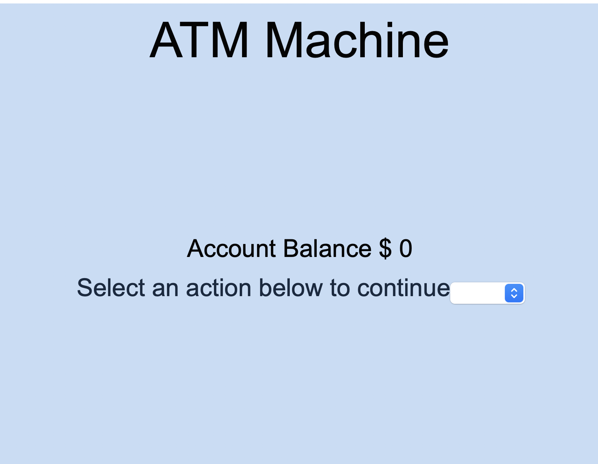

<h1 align="center">ATM Exercise</h1>
 
<h3 align="center">Creating an ATM app using React</h3>
 

 

 
 

*Click to see: [Github page for this repository](https://suja-codes.github.io/ATM/)*

### Description 

- Simulation of an ATM based on the following principles:

- Input validation

    - It works by saving state after each submit click and recalculating the balance of the account.
  
    - As a result, Cash backs bigger than balance are not allowed.
  
    - Account balance can't go negative since withdrawals more than what's actually available in the account is not permitted.

  
-  Conditional rendering for the number input and submit fields. 

    - This means that they will not even show on the page before the user has selected an action (Deposit or Cash Back).
  
    - This avoids confusion for the user and keeps UI neat.
  

### To Run this Program

In order to run this file, Fork and Clone the repository to your local machine.

- Start a http server in your terminal or a live server in visual studio code.

- Open the standalone.html in the server.

### Future RoadMap

This project can be still be enhanced by alerting the user with notifications for end of day balance.

### License

This exercise stems from MIT xPRO Professional Certificate in Coding: Full Stack Development with MERN Program

> MIT License

> Copyright (c) 2022 Sujatha Arunagiri

> Permission is hereby granted, free of charge, to any person obtaining a copy
> of this software and associated documentation files (the "Software"), to deal
> in the Software without restriction, including without limitation the rights
> to use, copy, modify, merge, publish, distribute, sublicense, and/or sell
> copies of the Software, and to permit persons to whom the Software is
> furnished to do so, subject to the following conditions:

> The above copyright notice and this permission notice shall be included in all
> copies or substantial portions of the Software.

> THE SOFTWARE IS PROVIDED "AS IS", WITHOUT WARRANTY OF ANY KIND, EXPRESS OR
> IMPLIED, INCLUDING BUT NOT LIMITED TO THE WARRANTIES OF MERCHANTABILITY,
> FITNESS FOR A PARTICULAR PURPOSE AND NONINFRINGEMENT. IN NO EVENT SHALL THE
> AUTHORS OR COPYRIGHT HOLDERS BE LIABLE FOR ANY CLAIM, DAMAGES OR OTHER
> LIABILITY, WHETHER IN AN ACTION OF CONTRACT, TORT OR OTHERWISE, ARISING FROM,
> OUT OF OR IN CONNECTION WITH THE SOFTWARE OR THE USE OR OTHER DEALINGS IN THE
> SOFTWARE.

  
